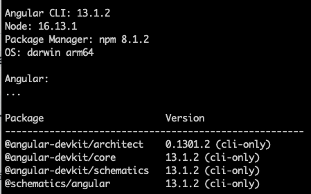
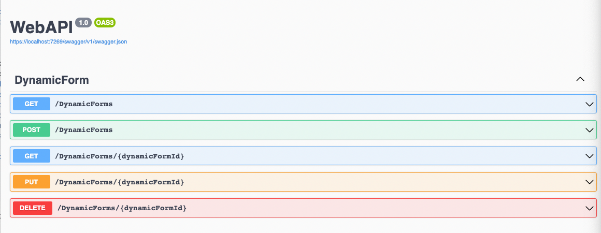
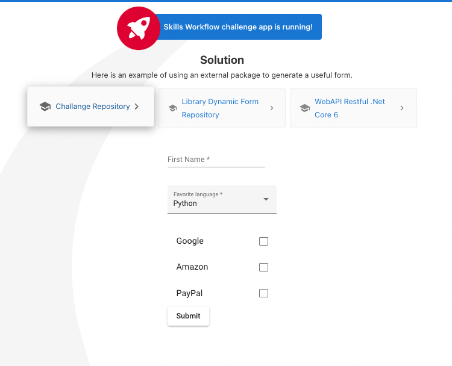
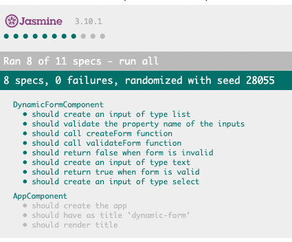
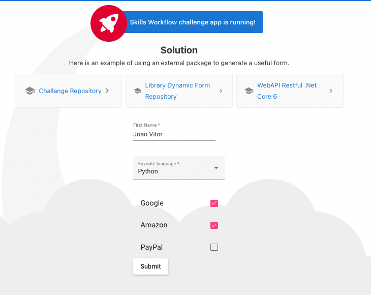
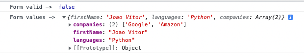

<h3 align="center">SkillsWorkflow Challenge Solution</h3>

  <p align="center">
    Project to allow the company accessing some of my skills 
    <br /> 
  </p>

## The challenge

The challenge consists of producing a reusable Angular module or library that contains a new component named `dynamic-form`.
When a developer includes this module or library on their application they should be able to use it as a directive on their html templates.

**Example**
```html
<dynamic-form [definition]="@formJSON" />
```

This component's purpose is to render forms dynamically at runtime.

These forms should be defined in JSON and should be able to handle 3 kinds of controls:
* text input
* selection combo-box
* list

### Built With
* [Angular 13](https://angular.io/)
* [.NET Core 6](https://docs.microsoft.com/pt-br/dotnet/core/compatibility/6.0)

<!-- GETTING STARTED -->
## Getting Started
### Prerequisites

* npm
  ```sh
  npm install npm@latest -g
  ```
* Node >= v16
  ```sh
  nvm install --lts
  ```
* .NET Core 6 `If you want to serve the formJSON from the restAPI`
  ```sh
  https://dotnet.microsoft.com/en-us/download/dotnet/6.0
  ```
* Angular 13
  ```sh
  npm install -g @angular/cli
  ```
  

## Installation
### Backend `Only if you want to serve the formJSON object from the API)`
1. Clone the repo
   ```sh
   git clone https://github.com/vitorjoaofg/skills-Workflow-Solution.git
   ```
2. Access the WebAPI folder
   ```sh
   cd skills-Workflow-Solution/WebAPI
   ```
3. Run the restAPI
   ```sh
   dotnet run
   ```
4. Open the Swagger documentation served on port 7269
   ```link
   https://localhost:7269/swagger
   ```
5. There is one available formJSON on the route: 
    ```sh 
    /DynamicForms/3fa85f64-5717-4562-b3fc-2c963f66afa6
    ```
* If you want to change the returning of this endpoint, have a look at  `FormInput.cs` file.


<br />

### Frontend (Dynamic Form Library)
There is already a package in the root project ready to be used
      ```sh
      dynamic-form-0.0.4.tgz
      ```
But if you want to generate a new version after some changes do the following:

1. Go to the root library folder
      ```sh
      cd lib-workspace/projects/dynamic-form/
      ```
2. Build the library to generate the dist folder
    ```sh
      ng build
      ```
3. Go to the /dist folder and run
    ```sh
      ng pack
      ```

### Frontend (Parent Application)
1. Go to the angular-app-demo application folder
    ```sh
      cd angular-app-demo
      ```
2. Install the dependencies
    ```sh
      npm install
      ```
3. Install the Dynamic Library
    ```sh
      npm install dynamic-form-0.0.4.tgz
      ```
4. At this point you will be able to use the library as a directive
    ```html
          <lib-dynamic-form(onFormSubmit)="onSubmit($event)" [definition]="formJSON"></lib-dynamic-form>
    ```
5. Test the application
    ```sh
        ng serve
    ```
    

## Testing
To run the tests of the component
1. ```sh
   npm test
   ```
    

<!-- USAGE EXAMPLES -->
## Usage
### All you have to do is pass a JSON to the library like this:
#### There are some formJSON available at:
1. External site
    ```sh
        https://api.npoint.io/165c2313a64f8c49b80d
    ```
2. Provided by backend
    ```sh 
        /DynamicForms/3fa85f64-5717-4562-b3fc-2c963f66afa6
    ```
### formJSON example
        {
          controls: [
            {
              name: "firstName",
              type: "text",
              label: "First name:",
              value: "",
              validators: {
                required: true,
                minLength: 5
              }
            },
            {
              name: "languages",
              type: "select",
              label: "Language",
              value: "Python",
              options: [
                "Python",
                "C#",
                "Angular",
                "React"
              ],
              validators: {
                required: true
              }
            },
            {
              name: "companies",
              type: "list",
              label: "Choose some comapanies",
              value: "",
              options: [
                "Google",
                "Amazon",
                "PayPal"
              ],
              validators: { }
            }
          ]
        }
<br />

### Passing a custom JSON
The demo project is configured to consume the JSON served by the .NET Core 6 RestAPI (so make sure your Backend application is running). `If you just want to pass a new JSON without needing the backend` , do the following
1. Go to the `app.component.ts` (Parent Application) and change it:
```ts
    restAPI = 'https://localhost:7269/DynamicForms/3fa85f64-5717-4562-b3fc-2c963f66afa6';
```
To
```js
    restAPI = '<pathToYourJSON>';
```

## Getting the form validation and its values to use at Parent Component

1. Create a onSubmit function and that's it :)
```ts
  onSubmit(dynamicForm: any) {
    console.log('Form valid -> ', dynamicForm.valid);
    console.log('Form values -> ', dynamicForm.value);
  }
```
2. Click on submit button


<br />

3. Do what you want with the form (with validation and its values)

See ya!! 

Best Regards,

Joao.


<!-- CONTACT -->
## Contact

João Vitor Gomes - vitorjoaofg@gmail.com 


